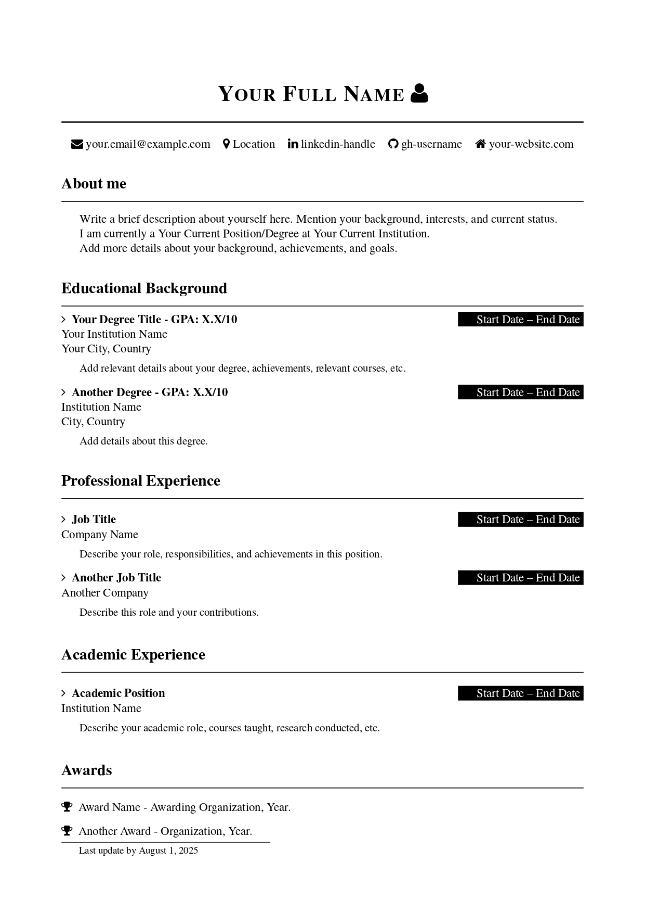
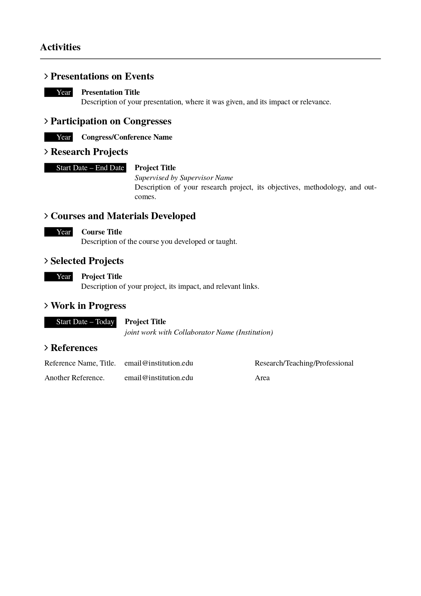

# LaTeX Academic/Professional CV Template

A professional, customizable CV template built with LaTeX featuring folder-based organization and easy personalization.

| Page 1 | Page 2 |
|--------|--------|
|  |  |

The early version of this CV Template was developed during a undergraduate course project in 2021. For that, I thank my colleagues: [Beatriz Barradas](https://github.com/barrafas), [Carol Erthal](https://github.com/anacarolerthal), [Murilo Calegari](https://github.com/MuriloCalegari) and [Vinícius Hedler](https://github.com/viniciushedler).

Recently, I decided to refactor this template to make it more accessible and user-friendly, so why not make it public?

Feel free to open an issue or submit a pull request if you have any suggestions or improvements. This template will be soon available on Overleaf.

## Features

- **Simple Commands**: User-friendly LaTeX commands (no complex formatting needed)
- **Folder-based Structure**: Each CV is self-contained in its own folder
- **Professional Layout**: Clean, academic-style formatting with FontAwesome icons
- **Template System**: Variables-based approach for easy content updates
- **Shared Configuration**: Common styling and commands shared across all CVs
- **Visual Elements**: Custom grading system and professional styling

## Quick Start

### 1. Copy the Template Folder

Create your own CV by copying the template folder:

```bash
cp -r template/ your-name/
cd your-name/
```

### 2. Customize Your Personal Data

Edit `personal-data.tex` with your information:

```latex
% Basic Information
\newcommand{\fullName}{Your Full Name}
\newcommand{\email}{your.email@example.com}
\newcommand{\location}{Your City, Country}
% ... and so on
```

### 3. Edit Your CV Content

Modify `cv.tex` using the simple command syntax:
- Use commands like `\experience{Title}{Date}{Company}{Description}`
- See `COMMANDS.md` for complete command reference
- Replace placeholder content with your own information

### 4. Compile Your CV

```bash
# From within your folder (e.g., your-name/)
pdflatex main.tex

# For complete compilation with references
pdflatex main.tex
pdflatex main.tex  # Run twice for proper cross-references
```

## File Structure

```
├── template/                         # Template folder to copy
│   ├── main.tex                      # Main LaTeX document
│   ├── cv.tex                        # CV content with example commands
│   └── personal-data.tex             # Personal information template
├── config/                           # Shared configuration (DON'T MODIFY)
│   ├── cv-commands.tex               # Custom LaTeX commands
│   ├── titles.tex                    # Title formatting
│   └── grades.tex                    # Visual elements and styling
├── your-name/                        # Your personal CV folder
│   ├── main.tex                      # Your main document
│   ├── cv.tex                        # Your CV content
│   └── personal-data.tex             # Your personal information
├── README.md                         # This file
├── COMMANDS.md                       # Complete command reference
```

## Using the Command System

### Quick Reference

For complete documentation, see `COMMANDS.md`. Here are the most common commands:

#### Basic Structure
```latex
\contactheader                          % Header with contact info
\aboutme{Your description...}           % About me section
```

#### Sections with Easy Commands
```latex
% Education
\begin{education}
    \educationentry{Degree}{Date Range}{Institution}{Location}{Description}
\end{education}

% Experience  
\begin{experiences}
    \experience{Job Title}{Date Range}{Company}{Description}
\end{experiences}

% Awards
\begin{awards}
    \award{Award Name}{Organization, Year}
\end{awards}
```

#### Activities Section
```latex
\begin{activities}
    \begin{presentations}
        \presentation{Year}{Title}{Description}
    \end{presentations}
    
    \begin{selectedprojects}
        \selectedproject{Year}{Project Title}{Description}
    \end{selectedprojects}
\end{activities}
```

### Customization

- **Personal Data**: Edit `personal-data.tex` in your folder with your information
- **Section Titles**: Modify title variables in `personal-data.tex`
- **Visual Styling**: Advanced users can edit `config/grades.tex` and `config/titles.tex`
- **Commands**: Developers can modify `config/cv-commands.tex`

## Template Sharing

This template is designed to be easily shareable:

1. **For Template Distribution**: Share the `template/` and `config/` folders
2. **For Personal Use**: Keep your personal folder (e.g., `your-name/`) private
3. **Version Control**: Add personal folders to `.gitignore` if using git

## Tips

- **Folder Names**: Use descriptive names like `john-academic/`, `john-industry/` for different CV versions
- **Multiple Versions**: Create separate folders for different purposes (academic, industry, etc.)
- **Consistent Formatting**: Follow the existing command patterns for best results
- **FontAwesome Icons**: Use icons like `\faAngleRight`, `\faTrophy`, `\faEnvelope` for visual appeal
- **Multiple Languages**: Create separate folders for different languages

## Requirements

- LaTeX distribution with the following packages:
  - fontawesome, hyperref, tikz, xcolor
  - tabularx, enumitem, titlesec
  - All packages are commonly available in standard LaTeX distributions

## Troubleshooting

- **Compilation errors**: Ensure you're running `pdflatex` from within your personal folder
- **Personal data not found**: Make sure `personal-data.tex` exists in your folder
- **Path issues**: All `\input` commands in `main.tex` use relative paths from your folder

## Contributing

This template is designed to be easily customizable and shareable. Feel free to adapt it to your needs and share improvements!